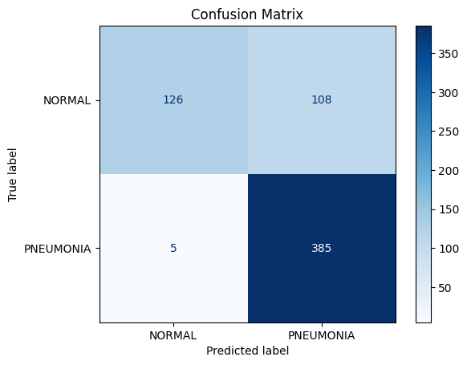
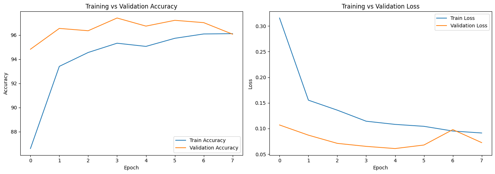
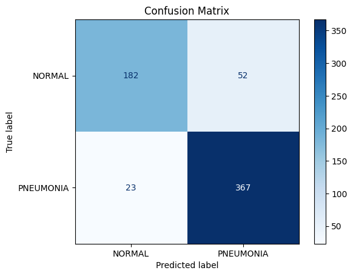
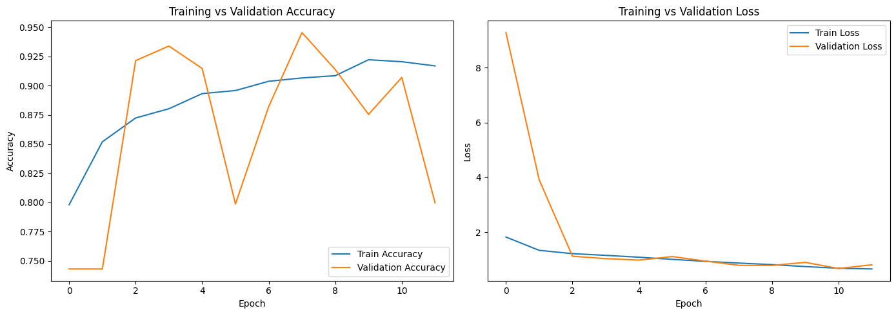
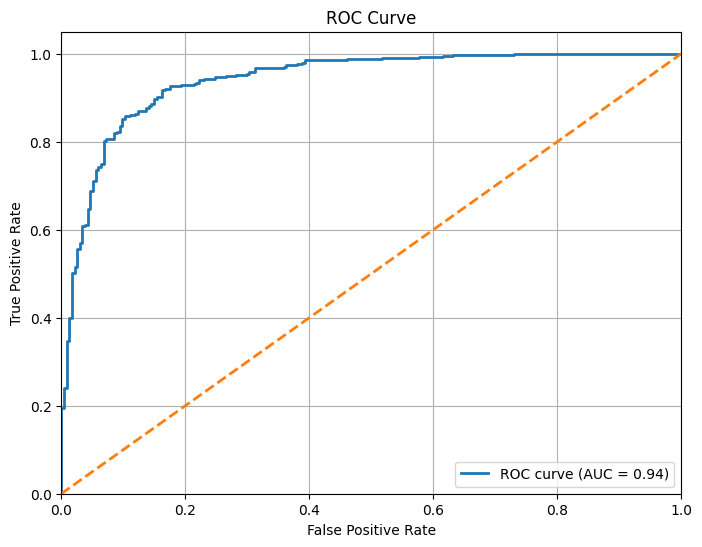
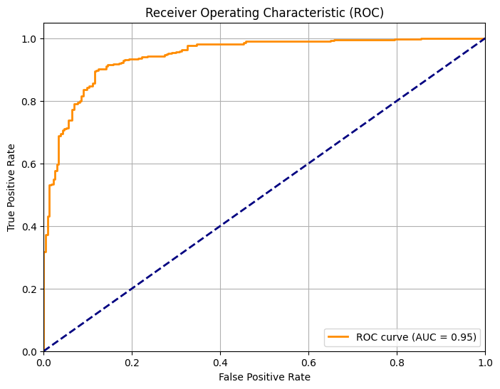
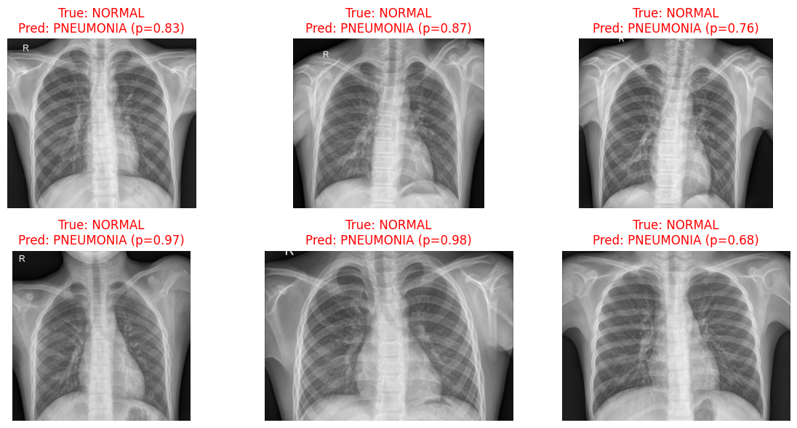
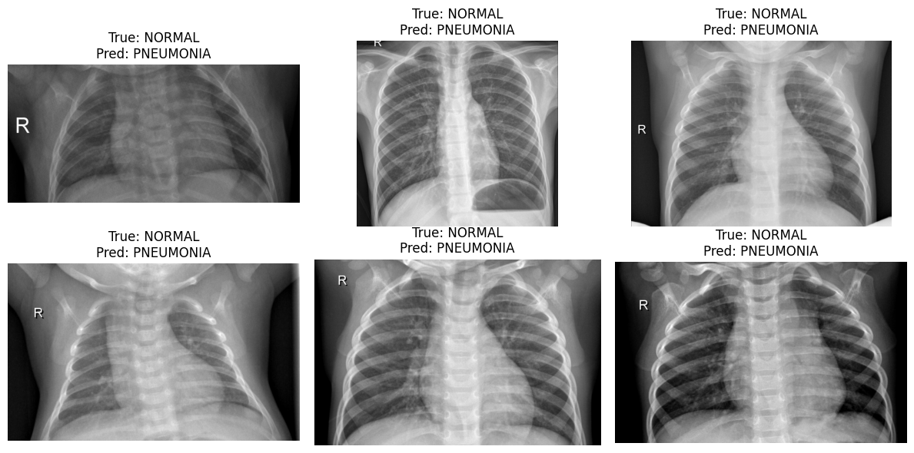

# 🔬 Pneumonia Detection using CNN (PyTorch vs TensorFlow)

This project explores the use of Convolutional Neural Networks (CNNs) for detecting pneumonia from chest X-ray images. The main objective was to compare two deep learning frameworks—PyTorch and TensorFlow—in terms of model performance, training dynamics, and ease of implementation. Additionally, a Flask web application is provided to demonstrate real-time pneumonia prediction using the TensorFlow model. The app is deployed with Docker for easy access.

---

## 📌 Goals
- Build and train CNN models on the Chest X-Ray Pneumonia dataset.
- Compare PyTorch and TensorFlow pipelines in terms of accuracy, loss, and classification performance.
- Evaluate results using confusion matrix, classification report, and accuracy/loss curves.
- Develop and deploy a Flask app with Docker, with an online Render demo

---

## 📁 Dataset

✨ The dataset used is the [Chest X-Ray Pneumonia dataset](https://www.kaggle.com/datasets/paultimothymooney/chest-xray-pneumonia), which contains chest X-ray images for diagnosing pneumonia. It includes:

- 🌟 Normal cases: Chest X-rays without pneumonia.
- ⚡️ Pneumonia cases: Chest X-rays diagnosed with pneumonia (bacterial or viral).

📊 The dataset provides separate folders for training, validation, and test sets with the following original counts:

| Set       | Total Samples | Normal | Pneumonia |
|-----------|---------------|--------|-----------|
| Train     | 5216          | 1341   | 3875      |
| Validation| 16            | 8      | 8         |
| Test      | 624           | 234    | 390       |

🔧 For this project, the training set was split into 80/20 for training and validation:

| Set            | PyTorch | TensorFlow |
|----------------|---------|------------|
| Train samples  | 4172    | 4173       |
| Validation samples | 1044  | 1043       |
| Test samples   | 624     | 624        |

ℹ️ *Note: The validation set was augmented by splitting 20% from the original training data due to the small size of the provided validation set (16 samples). Images were preprocessed to 150x150 pixels and converted to grayscale for consistency. Data augmentation was applied to address the dataset's imbalance.*

---

## 🧠 Model Architectures & Training  

### 🔹 PyTorch Model  
- Custom CNN with convolutional, pooling, dropout, and fully connected layers  
- Optimizer: Adam (with weight_decay=0.005)  
- Learning Rate: 0.00025 (reduced to 0.0001 after epoch 7 via scheduler)  
- Batch Size: 16  
- Dropout: 0.8  
- Pos Weight: 0.77  
- Training stopped early at epoch 8  

### 🔹 TensorFlow Model  
- Custom CNN implemented using Keras Sequential API  
- Optimizer: Adam  
- Learning Rate: 0.00025  
- Batch Size: 16  
- Dropout: 0.8  
- Training stopped early at epoch 12

---

## 📊 Results

### 🔹 PyTorch Results
- Training Accuracy: 86.6% → 96.1% (improving over epochs)
- Validation Accuracy: 97.41% (best at epoch 4)
- Test Set Performance:
  - Confusion Matrix: 126 normal, 385 pneumonia correct — 108 normal misclassified as pneumonia
  - Classification Report: Detailed metrics are summarized in the table below
  - Accuracy: 82%
  - AUC: 0.94
- Visuals:
  ✨ 
  ✨ 

| Metric             | PyTorch         |
|--------------------|-----------------|
| Accuracy           | 82%             |
| Precision (Normal) | 0.96            |
| Recall (Normal)    | 0.54            |
| Precision (Pneumonia) | 0.78        |
| Recall (Pneumonia) | 0.99            |
| F1-score (Normal)  | 0.69            |
| F1-score (Pneumonia) | 0.87         |
| AUC                | 0.94            |

### 🔹 TensorFlow Results
- Training Accuracy: 74% → 92% (improving over epochs)
- Validation Accuracy: 94.54% (best at epoch 8)
- Test Set Performance:
  - Confusion Matrix: 182 normal, 367 pneumonia correct — 52 normal and 23 pneumonia misclassified
  - Classification Report: Detailed metrics are summarized in the table below
  - Accuracy: 88%
  - AUC: 0.95
- Visuals:
  ✨ 
  ✨ 

| Metric             | TensorFlow      |
|--------------------|-----------------|
| Accuracy           | 88%             |
| Precision (Normal) | 0.89            |
| Recall (Normal)    | 0.78            |
| Precision (Pneumonia) | 0.88        |
| Recall (Pneumonia) | 0.94            |
| F1-score (Normal)  | 0.83            |
| F1-score (Pneumonia) | 0.91         |
| AUC                | 0.95            |

---

## ⚖️ Comparison: PyTorch vs TensorFlow
| Aspect             | PyTorch                          | TensorFlow                       |
|--------------------|-----------------------------------|-----------------------------------|
| Validation Accuracy | 97.41% (higher recall)       | 94.54% (more balanced)           |
| Precision vs Recall | Recall ↑ (0.99), Precision ↓     | Balanced (Precision: 0.89, Recall: 0.94) |
| Training Dynamics  | Faster convergence, flexible     | Stable training, simpler Keras API |
| Visualization      | Manual plotting required         | Built-in TensorBoard support     |
👉 ⚖️ Takeaway:
- PyTorch shines in pneumonia detection with high recall (fewer false negatives), ideal for critical diagnostics.
- TensorFlow offers balanced classification with a slightly higher AUC, suitable for general use.
- ✅ Both frameworks deliver strong results; the choice hinges on project priorities (e.g., recall vs. balance).

---

## 🖼 Visualizations
For convenience, all visualizations are gathered here:

### Confusion Matrices:
- **PyTorch Confusion Matrix**
  
- **TensorFlow Confusion Matrix**
  
  
### Accuracy vs Loss Curves:
- **PyTorch Accuracy vs Loss**
  
- **TensorFlow Accuracy vs Loss**
  
  
### ROC Curves (AUC comparison):
- **PyTorch ROC Curve**
  
- **TensorFlow ROC Curve** 
  
  
### Examples of Misclassification:
- **PyTorch Misclassified Example**
  
- **TensorFlow Misclassified Example**
  
  
---

## 💻 Web Application
The pneumonia_app/ directory contains a Flask-based web application, which uses the TensorFlow model (best_model.keras) for real-time pneumonia prediction from chest X-ray images. The app is containerized with Docker for easy deployment.

📌 *Note: The TensorFlow model is chosen for its Keras compatibility.*

### 🐳 Run with Docker

1. Clone the repository:
   ```bash
   git clone https://github.com/yourusername/Pneumonia_Classification_CNN.git
   cd Pneumonia_Classification_CNN/pneumonia_app

2. Build the Docker image:
   ```bash
   docker build -t pneumonia_app .

3. Run the container:
   ```bash
   docker run -p 5000:5000 pneumonia_app

4. Open the app in your browser at:

👉 http://localhost:5000


📌 Ensure best_model.keras (from Pneumonia_CNN_TensorFlow/) is placed inside the pneumonia_app/ directory.

📌 Adjust the port mapping (e.g., -p 8080:5000) if port 5000 is occupied.

### 🌐 Run on Render

You can also deploy the app online with Render for a live demo:
#### Prerequisites
- A [Render account](https://render.com/)
- Project pushed to a GitHub repository
#### Steps
1. Push your project to GitHub (ensure best_model.keras is in the pneumonia_app/ directory).
2. Go to the [Render Dashboard](https://dashboard.render.com/) and create a New Web Service.
3. Connect your GitHub repo and set pneumonia_app/ as the root directory.
4. Ensure a `render.yaml` file is in the repository root; Render will use it to build and deploy automatically.
5. After deployment, your app will be available at a public URL (shown in the Render Dashboard, e.g., [https://your-app.onrender.com](https://your-app.onrender.com/)).
📌 *Tip: If deployment fails, check Render logs for error details.*

---

## 🔗 Additional Resources
📘 Explore this project interactively and view the training outputs on Kaggle notebooks:
- 👉 [PyTorch Notebook](https://www.kaggle.com/code/foroughgh95/pneumonia-detection-with-cnn-pytorch) - Includes model training and evaluation with PyTorch.
- 👉 [TensorFlow Notebook](https://www.kaggle.com/code/foroughgh95/pneumonia-detection-with-cnn-tensorflow-keras) - Includes model training and evaluation with TensorFlow.

---

## ⚖️ License  
This project is licensed under the MIT License. See the [LICENSE](../LICENSE) file for details.

---

## 👩‍💻 Author
Developed by Forough Ghayyem  
📫 [GitHub](https://github.com/foroughm423) | [LinkedIn](https://www.linkedin.com/in/forough-ghayyem/) | [Kaggle](https://www.kaggle.com/foroughgh95)
